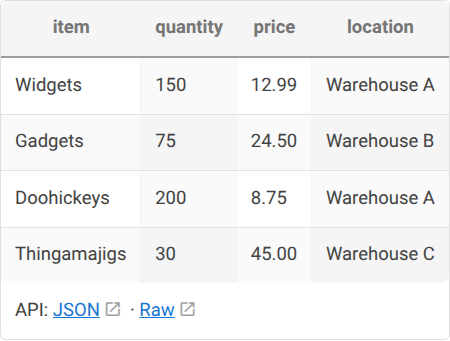

# Wiki.js Plugins

Custom plugins for [Wiki.js v2](https://js.wiki/).

## Plugins

### [Data Gremlin](plugin/html-data-gremlin/)

Turns fenced code blocks (JSON, CSV, TSV, text) into rendered HTML tables and exposes them as REST API endpoints.



### [Table Tidy](plugin/analytics-table-tidy/)

Auto-formats markdown tables in the Wiki.js editor. Aligns pipes, pads cells, and adds Tab-to-next-cell navigation. Also available as a Tampermonkey userscript or bookmarklet.

```
| Name  | Role             | Dept        |
|-------|------------------|-------------|
| Alice | Engineering Lead | Engineering |
| Bob   | PM               | Product     |
```

### [Footnotes](plugin/html-footnotes/)

Adds footnote/citation support for the Visual Editor (CKEditor). Type `[^1]` inline and `[^1]: reference text` anywhere — the renderer collects them into a numbered footnotes section at the bottom. Includes an optional analytics module that adds a toolbar button and `Ctrl+Shift+F` shortcut for inserting footnotes.

## Quick Start

```yaml
services:
  wiki:
    image: requarks/wiki:2
    volumes:
      - ./plugin/html-data-gremlin:/wiki/server/modules/rendering/html-data-gremlin
      - ./plugin/ext-data-gremlin:/wiki/server/modules/extensions/data-gremlin
      - ./plugin/analytics-table-tidy:/wiki/server/modules/analytics/table-tidy
      - ./plugin/html-footnotes:/wiki/server/modules/rendering/html-footnotes
      - ./plugin/analytics-footnote-btn:/wiki/server/modules/analytics/footnote-btn
```

Then enable in **Admin > Rendering** (Data Gremlin, Footnotes) and **Admin > Analytics** (Table Tidy, Footnote Button).

## License

MIT
