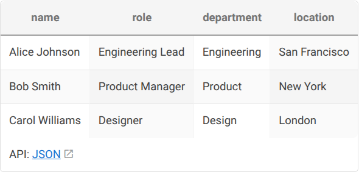
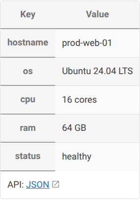
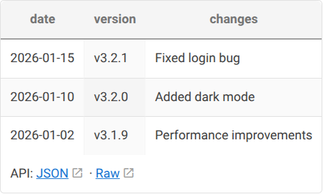
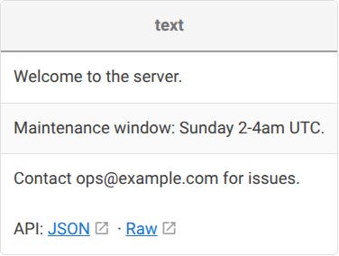
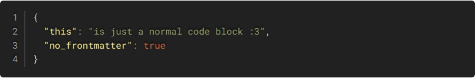

# Data Gremlin

A Wiki.js v2 plugin that turns fenced code blocks into rendered tables and exposes them as REST API endpoints. Supports JSON, CSV, TSV, and plain text.

## How It Works

Any fenced code block with a YAML frontmatter header containing an `id` field gets picked up by the gremlin. It renders the data as an HTML table on the wiki page and makes it available as an API endpoint at `/gremlin/<id>`.

Blocks **without** frontmatter are left untouched — they render as normal syntax-highlighted code.

## Installation

### Docker Compose (development)

```yaml
services:
  wiki:
    image: requarks/wiki:2
    volumes:
      - ./plugin/html-data-gremlin:/wiki/server/modules/rendering/html-data-gremlin
      - ./plugin/ext-data-gremlin:/wiki/server/modules/extensions/data-gremlin
```

### Dockerfile (production)

```dockerfile
FROM requarks/wiki:2
COPY plugin/html-data-gremlin /wiki/server/modules/rendering/html-data-gremlin
COPY plugin/ext-data-gremlin  /wiki/server/modules/extensions/data-gremlin
```

### Manual

Copy the plugin directories into your Wiki.js installation:

```
plugin/html-data-gremlin -> <wiki>/server/modules/rendering/html-data-gremlin
plugin/ext-data-gremlin  -> <wiki>/server/modules/extensions/data-gremlin
```

Restart Wiki.js. The renderer appears in **Admin > Rendering** and the extension registers automatically.

## Usage

Add a fenced code block to any Markdown page with a `---` frontmatter header containing at least an `id` field:

````markdown
```json
---
id: my-data
---
[
  { "name": "Alice", "role": "Engineer" },
  { "name": "Bob", "role": "Designer" }
]
```
````

The `id` is what identifies the block in the API (`/gremlin/my-data`).

## Supported Formats

### JSON — Array of Objects

````markdown
```json
---
id: team-demo
---
[
  { "name": "Alice Johnson", "role": "Engineering Lead", "department": "Engineering" },
  { "name": "Bob Smith", "role": "Product Manager", "department": "Product" }
]
```
````



### JSON — Key-Value Object

````markdown
```json
---
id: server-info
---
{
  "hostname": "prod-web-01",
  "os": "Ubuntu 24.04 LTS",
  "cpu": "16 cores",
  "ram": "64 GB",
  "status": "healthy"
}
```
````



### CSV

````markdown
```csv
---
id: inventory-demo
---
item,quantity,price,location
Widgets,150,12.99,Warehouse A
Gadgets,75,24.50,Warehouse B
```
````


### TSV

````markdown
```tsv
---
id: changelog-demo
---
date	version	changes
2026-01-15	v3.2.1	Fixed login bug
2026-01-10	v3.2.0	Added dark mode
```
````



### Plain Text

````markdown
```text
---
id: motd-demo
---
Welcome to the server.
Maintenance window: Sunday 2-4am UTC.
Contact ops@example.com for issues.
```
````



### No Frontmatter = Normal Code Block

Code blocks without the `---` frontmatter are not touched:

````markdown
```json
{ "this": "is just a normal code block", "no_frontmatter": true }
```
````



## API

Each block with an `id` is exposed as an API endpoint:

```
GET /gremlin/<id>          -> parsed data as JSON
GET /gremlin/<id>?raw      -> original source content (CSV/TSV/text returned as-is)
```

Examples:

```bash
# Get parsed JSON
curl http://localhost:3000/gremlin/team-demo

# Get raw CSV source
curl http://localhost:3000/gremlin/inventory-demo?raw
```

The `?raw` parameter returns the original content with the appropriate content type (`text/csv`, `text/tab-separated-values`, `text/plain`). JSON blocks don't show a `Raw` link since JSON is already the default API format.

API responses are cached in memory (60s TTL) and invalidated automatically when any page is updated.

## Configuration

All settings are in **Admin > Rendering > Data Gremlin (JSON Table API)**:

| Setting | Default | Description |
|---------|---------|-------------|
| **API Route Path** | `/gremlin/:id` | Express route pattern. Must contain `:id`. Requires restart. |
| **Enable API Endpoint** | `true` | Toggle the REST API on/off. Requires restart. |
| **Show API Link** | `true` | Show `JSON` / `Raw` links in a table footer row. |
| **CSS Class** | `json-api-table` | Class applied to rendered `<table>` elements. |
| **Custom Renderers** | `[]` | JSON array of `{"name": "...", "code": "..."}` for custom table rendering functions. |

### Custom Renderers

You can define custom rendering functions in the admin UI. Each renderer is a JS function body that receives `(data, columns)` and returns an HTML string for the table body.

Use the `render` frontmatter field to select a custom renderer:

````markdown
```json
---
id: my-data
render: my-custom-renderer
---
[...]
```
````

## Architecture

The plugin consists of two modules:

- **`html-data-gremlin`** — An HTML rendering module (child of `htmlCore`). Runs in the render worker process. Receives a Cheerio `$` instance, finds code blocks with frontmatter, and replaces them with HTML tables.

- **`ext-data-gremlin`** — An extension module. Runs in the master process where Express is available. Registers the API route and handles caching.
